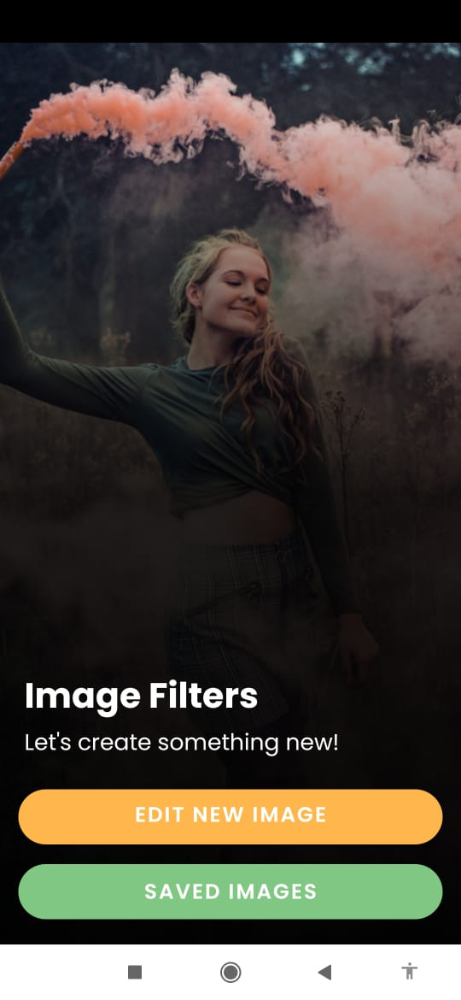
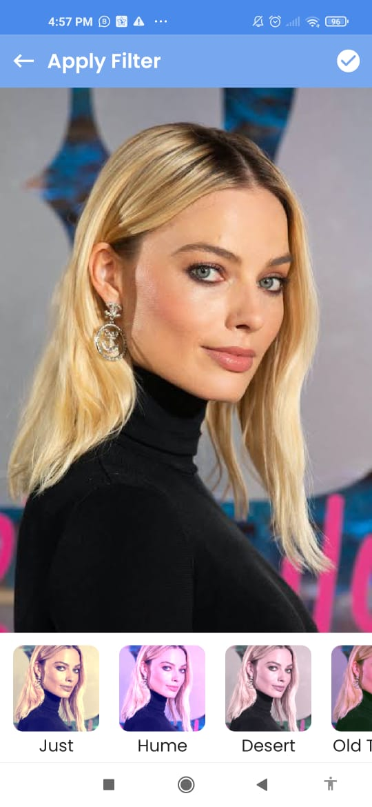
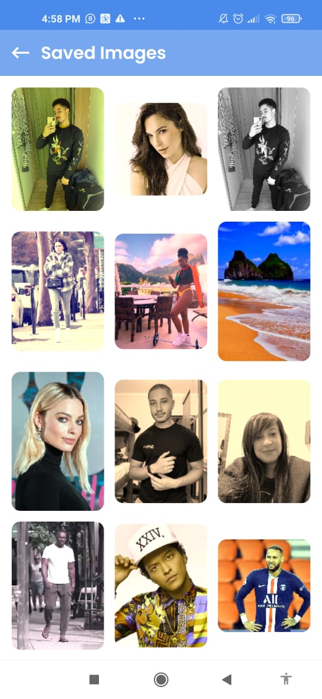

# PhotoFilters-Kotlin-MVVM
### Creating a simple filter app with a massive code logic 

<b>I used libraries such as:</b> Lifecycle, koin, gpuImage, Round image view,intuit

 

<b>Design Pattern:</b> MVVM - Coroutines - Dependency Injection

 
 
